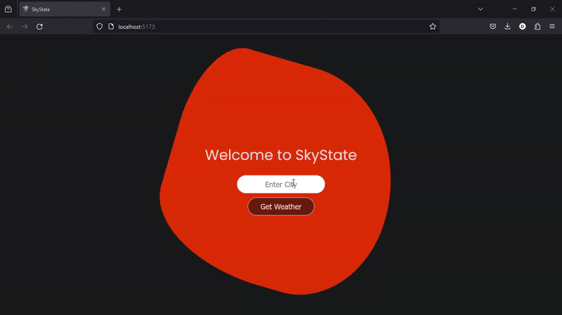

# SkyState

A React + Vite and Django Weather App



## Features

1. Current Day Weather Data

   - Temperature
   - "Feels Like" Temperature
   - Humidity
   - Description (Air, Cloud condition etc.)

2. 5-Day Weather Data
   - Temperature
   - Humidity
   - Description

## Setup Instructions

1. Clone the repository:

   ```bash
   git clone https://github.com/daimbk/skystate.git
   cd skystate
   ```

2. ### Django (Backend)

   Create Virtual Environment

   ```bash
   cd backend
   python -m venv venv
   source venv/bin/activate
   ```

   Install Packages

   ```bash
   pip install -r requirements.txt
   ```

   Migrate Database & Run Server

   ```bash
   python manage.py migrate
   python manage.py runserver
   ```

3. ### React + Vite (Frontend)

   ```bash
   cd frontend
   npm install
   npm run dev
   ```
